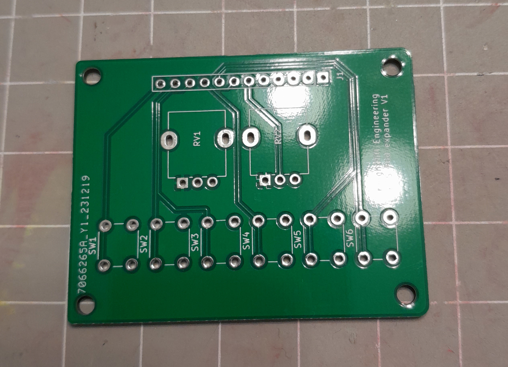
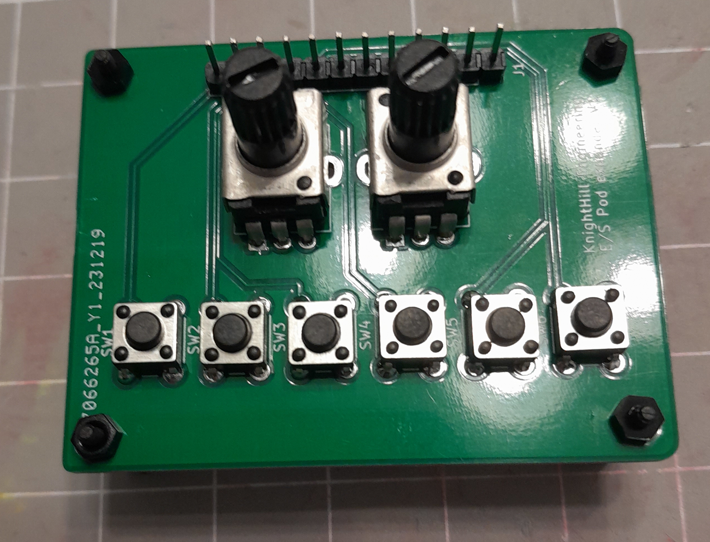

# ElectroSmith POD basic expander

[ElectroSmith POD](https://www.electro-smith.com/daisy/pod)

Adds two potentiometers and six buttons to the pod. Check the included KiCad 7 [schematics](hardware) for details.

