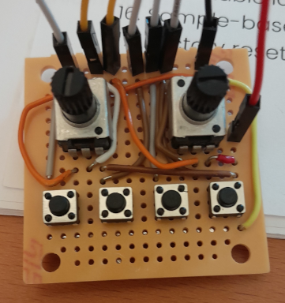

# ElectroSmith POD basic expander

[ElectroSmith POD](https://www.electro-smith.com/daisy/pod)

Adds two potentiometers and four buttons to the pod.



## libdaisy changes

### daisy_pod.cpp
```cpp
#define SW_3_PIN 7 
#define SW_4_PIN 8 
#define SW_5_PIN 9 
#define SW_6_PIN 10

#define KNOB_3_PIN 22 
#define KNOB_4_PIN 16

void DaisyPod::ProcessAnalogControls()
 {
     knob1.Process();
     knob2.Process();
+    knob3.Process();
+    knob4.Process();
 }

 void DaisyPod::ProcessDigitalControls()
 {
     encoder.Debounce();
     button1.Debounce();
     button2.Debounce();
+    button3.Debounce();
+    button4.Debounce();
+    button5.Debounce();
+    button6.Debounce();
 }

void DaisyPod::InitButtons()
 {
     // button1
     button1.Init(seed.GetPin(SW_1_PIN));
+
     // button2
     button2.Init(seed.GetPin(SW_2_PIN));
 
+    // button3
+    button3.Init(seed.GetPin(SW_3_PIN));
+
+    // button4
+    button4.Init(seed.GetPin(SW_4_PIN));
+
+    // button5
+    button5.Init(seed.GetPin(SW_5_PIN));
+
+    // button6
+    button6.Init(seed.GetPin(SW_6_PIN));
+
     buttons[BUTTON_1] = &button1;
     buttons[BUTTON_2] = &button2;
+    buttons[BUTTON_3] = &button3;
+    buttons[BUTTON_4] = &button4;
+    buttons[BUTTON_5] = &button5;
+    buttons[BUTTON_6] = &button6;
 }

 void DaisyPod::InitKnobs()
{
     AdcChannelConfig knob_init[KNOB_LAST];
     knob_init[KNOB_1].InitSingle(seed.GetPin(KNOB_1_PIN));
     knob_init[KNOB_2].InitSingle(seed.GetPin(KNOB_2_PIN));
+    knob_init[KNOB_3].InitSingle(seed.GetPin(KNOB_3_PIN));
+    knob_init[KNOB_4].InitSingle(seed.GetPin(KNOB_4_PIN));
     // Initialize with the knob init struct w/ 2 members
     // Set Oversampling to 32x
     seed.adc.Init(knob_init, KNOB_LAST);
     // Make an array of pointers to the knobs.
     knobs[KNOB_1] = &knob1;
     knobs[KNOB_2] = &knob2;
+    knobs[KNOB_3] = &knob3;
+    knobs[KNOB_4] = &knob4;
     for(int i = 0; i < KNOB_LAST; i++)
     {
     }
}

```

### daisy_pod.h

```cpp
class DaisyPod
     {
         BUTTON_1,    /** & */
         BUTTON_2,    /** & */
+        BUTTON_3,    /** & */
+        BUTTON_4,    /** & */
+        BUTTON_5,    /** & */
+        BUTTON_6,    /** & */
         BUTTON_LAST, /** &  */
         
         KNOB_1,    /** &  */
         KNOB_2,    /** & */
+        KNOB_3,    /** &  */
+        KNOB_4,    /** & */
         KNOB_LAST, /** & */

        Encoder       encoder;     /**< & */
        AnalogControl knob1,       /**< & */
        knob2,                 /**< & */
+       knob3,                 /**< & */
+       knob4,                 /**< & */
        *knobs[KNOB_LAST];     /**< & */
        Switch button1,            /**< & */
        button2,               /**< & */
+        button3,               /**< & */
+        button4,               /**< & */
+        button5,               /**< & */
+        button6,               /**< & */
         *buttons[BUTTON_LAST]; /**< & */
        RgbLed led1,               /**< & */
        led2;                  /**< & */

     };
 
```


